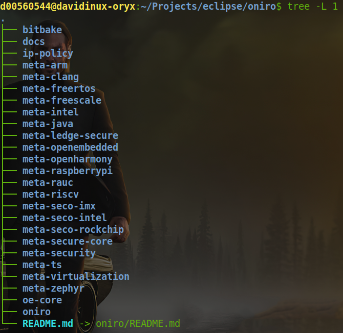

<!-- All images are in the open source domain, courtesy of pexels.com  -->

<!-- Title Slide  -->

# Oniro, a production oriented, reference operating system for devices big and small

---
<!-- paginate: true -->

<!-- Slide 1 -->

# Who's Oniro for?

## Directly

  * End users
  * Applications and content creators
  * Device makers

## Indirectly

  * Hardware vendors
  * Operating Systems vendors
  * System integrators

---

<!-- Slide 2 -->

# Dining philosophers?

## Devices | End users | Applications 

---

<!-- Slide 3 -->

# Device makers pain points

  * Technology fragmentation, yet similar components (linux, zephyr, java, qt, ...)
  * Pre-existing investments: infrastructure, code, tools
  * Overspending in a "commodity" (R&D as well as product release operations)
  * Underspending in value add 

---

<!-- Slide 4 -->

# The role and business impact of open source

  * Innovation engine
  * Developers oriented: code, documentation, tutorials,...
  * Faster time to market
  * Lower cost of expertise

---

<!-- Slide 5 -->

# Production oriented open source

  * Roadmap predictability
  * Life cycle predictability
  * Opinionated defaults: reference images as opposed to collection of libraries
  * Continuous Integration, Continuous Deployment, Continuous Validation, Continuous Compliance
  * Compliance envelope: production artifacts such as V&V reports, SWBOM
  * Bugs and CVEs policies with Service Level Agreements

---

<!-- Slide 6 -->

# 20% development | 80% maintenance

---

<!-- Slide 7 -->

# Oniro is addressing the ice under water 

  * Production oriented open source
  * Shared cost of production oriented operations and activities
  * Shared cost of maintenance
  * Shared roadmap (components, features, supported VS experimental)
  * Choose common opinionated defaults 
  * Shared cost of CI/CD and compliance envelope
  * Immediately usable production artifacts
  * Aligned to pre-existing investments

---

<!-- Slide 8 -->

# Save money | No costs of switching | No lock-in

---

<!-- Slide 9 -->

# Market driven development

  * Market analysis 
  * Requirements grouping 
  * Work prioritization (20/80 rule, again!)
  * Integration, opinionated defaults and blueprints, testing, documenting, compliance artifacts (60/10/10/10/10)
  * Infrastructure

---

<!-- Slide 10 -->

# Down the hole?

---

<!-- Slide 11 -->

# Industry's favored sausage making factory 

## Bitbake

  * Heart of the Yocto Project
    * Broad collection of Linux libraries and software
  * Linaro's Ledge project
    * Hardware scalability
  * Layered architecture

---

<!-- Slide 12 -->

# Oniro's layers
  * build system
  * oniro recipes
  * open embedded core recipes (including linux kernel)
  * hardware support
  * documentation
  * ip policy
  * zephyr and freertos
  * system OTA
  * openharmony

---

<!-- Slide 13 -->

# Devices, big and small (a.k.a. "flavours")

  * Linux 5.10 for higher end devices (Cortex A, Intel, RISC-V)
  * Zephyr 3.1 (default, LF project, used by Linaro's Lite) for lower end devices (Cortex M)
  * FreeRTOS (experimental)
  * Lite OS (comes with meta-openharmony, used in Huawei's devices)
  
---

<!-- Slide 14 -->

# Hardware support 
## Supported
  * Seco's NXP i.MX8 (Cortex A + M), Intel and Rockchip (supported)
  * QEMU 32 and 64, Intel, Arm, RISC-V
## Experimental  
  * ST Micro, Xilinx (experimental)
  * 2 weeks from inclusion to build / testing for YP and Zephyr supported targets
  
---

<!-- Slide 15 -->

# Dining philosophers?

## Devices | End users | Applications 

---

<!-- Slide 16 -->

# Makers, a special type of end users 

  * Kick the tires
  * Contribute
  * Build the brand

---

<!-- Slide 17 -->

# Hardware support 

## Supported 
  * Seco's NXP i.MX8 (Cortex A + M Linux + Zephyr), Intel and Rockchip (Linux)
  * QEMU 32 and 64, Intel, Arm, RISC-V
  * **Raspberry Pi (Linux)**
  * **Arduino Nano BLE (Zephyr)**
  
---

<!-- Slide 18 -->

# Interoperability 

  * Project Matter (protocol)
  * OpenThread (transparent gateway)
  * OpenHarmony (devices interoperability)
  * Podman (containers)
  * ModBUS (industrial IoT)
  * LVGL / Flutter (UI portability)
  * RAUC (SysOTA)
  
---

<!-- Slide 19 -->

# Compliance envelope, verification and validation

  * OpenChain and OpenSSF
  * Continuous license compliance with dashboard and SWBOM for supported configurations
  * LAVA (Linaro Automation and Validation) with central server and peripherical hw labs nodes

---

<!-- Slide 20 -->

# Life cycle

  * One release / year (update kernels, toolchains, runtime, new hw support)
  * Three years maintenance with decreasing level of service (based on severity)
  * Extended maintenace, tailored SWBOMs, product testing for working group members

---

<!-- Slide 21 -->

# So far so good 

  * A market centric approach has given us speed and focus
  * The industry has done a whole lot of work around individual components 
  * We have spent most of the time integrating, testing, documenting, releasing
  * We have tried to address a technical gap (breadth of devices) and business gap (production oriented open source)

---

<!-- Slide 22 -->

# The hard part is ahead ... 

  * Semantic web and device cooperation
  * Device management and updates
  * Blockchain decentralized device onboarding and authentication
  * Production ready performance
  * More blueprints, contributions, supporters, products, users

---

<!-- Slide 23 -->

# Thank you
[https://oniroproject.org/resource-center/](https://oniroproject.org/resource-center/)
[https://www.linkedin.com/in/dricci/](https://www.linkedin.com/in/dricci/)

