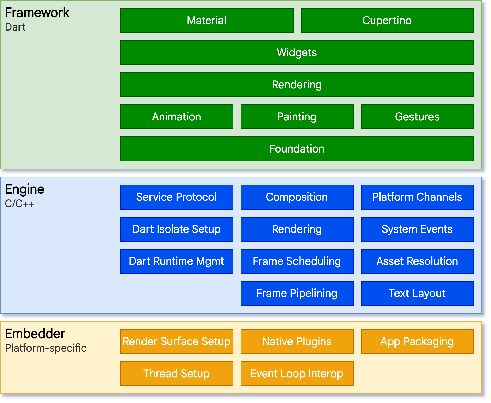
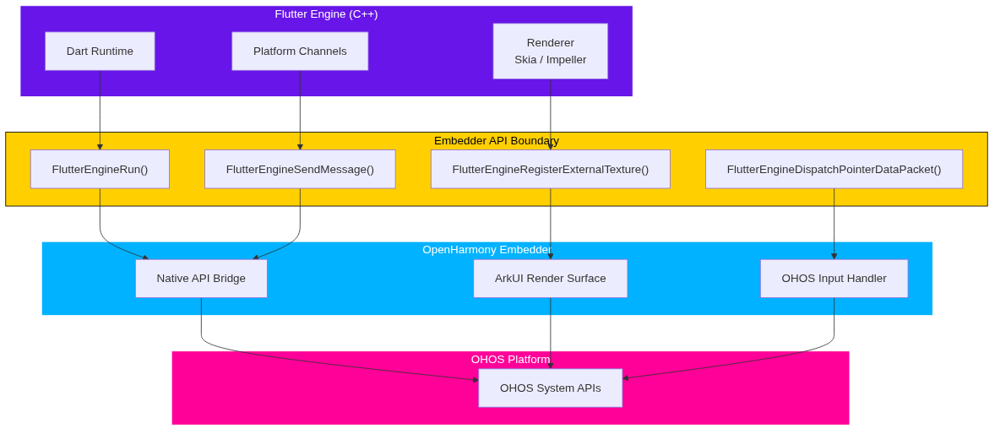
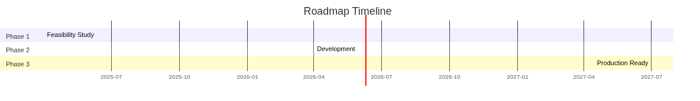
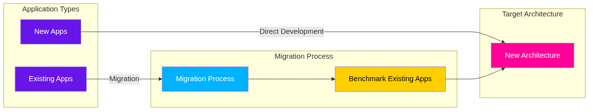
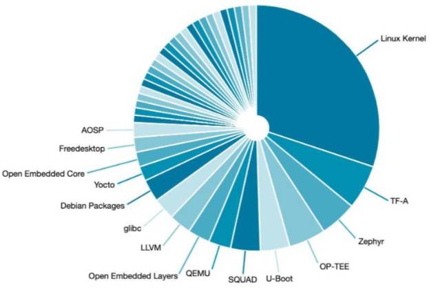

# Flutter on OpenHarmony: 新的 Embedder API 方向

Linaro 解决方案与服务部  
副总裁兼总经理  

HDC 2026 - 深圳  

---
layout: two-cols
---

::title::
# 挑战

::left::
## 跨层耦合

Flutter 各平台适配长期以来都把平台特定代码散落在多个层级中，而非隔离在 Embedder 层。
Android、Linux、Tizen、iOS 均存在这一模式——OpenHarmony 是最新面临这一问题的平台。

- **→** 平台代码与非平台代码相互纠缠
- **→** 平台特定代码的纠缠，使代码难以干净地回馈上游社区

::right::
## 影响

- **→** 每次 Flutter 发布都需要大量返工
- **→** 新特性的采用速度显著下降
- **→** 维护负担随时间持续累积

ArkUI、APK 等兼容性差异只是表象，并非根因。

---
layout: two-cols
---

::title::
# 首先——什么是 Flutter Embedder？

<!-- 每页 

---

# 三种方案评估

| 方案 | 描述 | 工作量 | 风险 |
|------|------|--------|------|
| **A** | 原生移植所有层（Framework + Engine + Embedder） | 非常高 | 高 |
| **B** | Fork Engine 渲染层（Impeller）适配 OpenHarmony | 高 | 中 |
| **C** | Flutter 引擎 + OpenHarmony Embedder（推荐） | 中 | 低 |

---
layout: two-cols
---

::title::
# 推荐方案：架构

::left::
## Flutter Embedder API

Embedder API 定义了 Flutter 引擎与平台代码之间稳定的 C 接口。各操作系统仅在 Embedder 层的实现上有所不同。

| API | 用途 |
|-----|------|
| `FlutterEngineRun(sz, config, user_data)` | 初始化并运行引擎 |
| `FlutterEngineSendMessage(engine, msg)` | 向 Dart 端发送平台消息 |
| `FlutterEngineRegisterExternalTexture(engine, id)` | 绑定外部渲染表面 |
| `FlutterEngineDispatchPointerDataPacket(engine, pkt)` | 转发触控/指针事件至引擎 |

::right::

---

# 各平台的 Embedder API

| 平台 | Embedder | 渲染表面 | 输入 |
|------|----------|---------|------|
| **Android** | JNI Embedder | SurfaceTexture | MotionEvent |
| **Linux** | flutter-embedded-linux | EGL / Wayland | libinput |
| **iOS** | UIKit Embedder | Metal CAMetalLayer | UIEvent |
| **OpenHarmony** | 原生 OHOS Embedder | ArkUI 渲染表面 | OHOS 输入处理器 |

Embedder API 接口在所有平台上是一致的——仅具体实现有所不同。OpenHarmony 沿用了与 Android、iOS、Linux 相同的模式。

---
layout: two-cols
---

::title::
# 方案架构

::left::
## 方向 C 方案

Flutter 引擎 + OpenHarmony Embedder：
- **→** OpenHarmony Embedder 处理平台集成
- **→** 原生 API 桥接连接 OpenHarmony 能力

::right::
## 主要优势

- **✓** 最小化移植成本——仅 Embedder 层需适配平台
- **✓** 最大化采用速度——新 Flutter 版本无须返工
- **✓** 利用现有 Flutter 生态（组件、工具链、包）
- **✓** 范围可控的可量产路径
- **✓** 尊重 OpenHarmony 架构

---

# 行业趋势——各厂商都在构建 Embedder

**Google**: Android 团队正积极迁移至 Flutter Embedder API
- **→** GitHub issue #176649: "Migrate Android to embedder API"
- **→** 参考: https://github.com/flutter/flutter/issues/176649

**Sony**: flutter-embedded-linux（1300+ 星标）
- **→** 嵌入式 Linux 设备、智能显示器、汽车

**Apple**: 为 iOS Embedder 采用 UIScene 生命周期
- **→** Issue #170171: "Adopting UIScene lifecycle in Flutter"
- **→** 参考: https://github.com/flutter/flutter/issues/170171

**Samsung**: 基于 Tizen 的 Flutter 计划
- **→** IoT 和可穿戴设备

---

# 路线图

| 阶段 | 时间 | 重点 |
|------|------|------|
| 第一阶段 | 2025年4月 | 可行性研究（已完成） |
| 第二阶段 | 2026年Q2 | 与 Flutter 社区联合开发 |
| 第三阶段 | 2027年Q3 | 可量产特性 |

---

# 应用迁移考量

**第二阶段并行活动：**

**性能评估**：新架构与当前实现对比  
**迁移成本分析**：识别并最小化现有应用的迁移成本  
**工具链开发**：构建迁移工具和策略  
**新应用开发**：基于新架构开发新应用  
**迁移基准**：以旧应用作为性能基准  

**迁移策略：**
- **→** 新应用 → 直接基于新架构（避免未来迁移）
- **→** 现有应用 → 逐步迁移作为基准
- **→** 风险缓解 → 通过早期问题识别

---

# 迁移流程

## 迁移策略

新应用 → 直接基于新架构  
现有应用 → 逐步迁移作为基准  

---
layout: two-cols
---

::title::
# Linaro 的角色——社区桥梁

::left::
## 开源生态贡献

- **→** 活跃贡献于多个开源社区
- **→** 连接开源社区与设备制造商
- **→** Flutter、OpenHarmony 及更广泛生态的技术专长
- **→** 影响技术方向，推动方案达到产品化要求

::right::

---
layout: two-cols
---

::title::
# Linaro 的角色——产业协调者

::left::

## 支持华为各业务部门

- **✓** 消费者、计算、云、网络
- **✓** 其他采用 OpenHarmony 的 OEM 厂商

::right::

## 提供的服务

- **→** 适配与开发
- **→** 测试与合规认证（CRA、ISO 27001）  
- **→** 部署与长期支持

---

# 谢谢 + 问答环节

**幻灯片：** github.com/davidinux/pub/conferences/hdc26  
**OH Slidev 主题：** github.com/davidinux/pub/templates/slidev/openharmony  

欢迎提问
