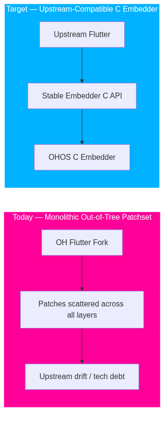
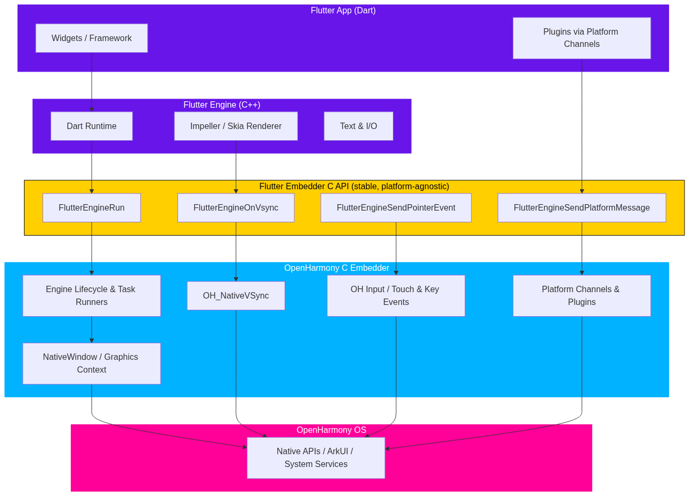
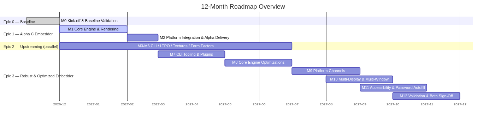
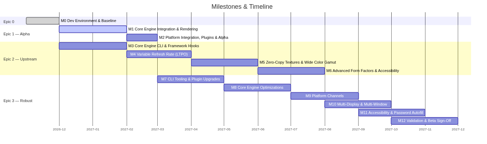

# OpenHarmony Flutter Embedder: A 12-Months Roadmap

Linaro Solutions & Services Group  
VP & GM, Solutions & Services  

Oniro Global Ecosystem 2026 - Prague  
October 3, 2026  

---
layout: two-cols
---

::title::
# Why Flutter on OpenHarmony

::left::
## A Rapidly Scaling Ecosystem

- **→** OpenHarmony's Flutter ecosystem is scaling rapidly across mobile, tablet, PC, and foldables
- **→** Flutter brings a rich widget ecosystem, tooling, and developer community to OpenHarmony
- **→** The current port works — but its architecture holds back long-term growth

::right::
## The Opportunity

- **→** Align OpenHarmony Flutter with upstream Flutter releases
- **→** Reduce long-term maintenance burden
- **→** Enable developers to use the same Flutter skills, packages, and workflows
- **→** Position OpenHarmony as a first-class Flutter target

---

# The Problem: Monolithic Out-of-Tree Patchsets

- **→** OHOS Flutter relies on monolithic, out-of-tree patchsets inherited from legacy implementations
- **→** Functional for early iterations, but it **fragments the fork from upstream Flutter**

---

# The Strategy: Decouple, Rewrite, Secure

**Three-part architectural strategy for the OpenHarmony Flutter port:**

- **✓** **Decouple** platform-specific code from the Flutter Engine using the stable Embedder C API
- **✓** **Rewrite** the platform integration as a dedicated, production-ready native C Embedder
- **✓** **Secure** the long-term architecture by upstreaming platform-agnostic OH patches

> A follow-up to the Phase 1 feasibility study that established the OpenHarmony Flutter engine repository.

---

# Why the Embedder C API

**The Flutter Embedder C API is stable, platform-agnostic, and future-proof:**

- **✓** **Stable interface** — defined by the upstream Flutter project, independent of any single OS
- **✓** **Forward- and backward-compatible** — API and ABI compatible across Flutter releases
- **✓** **Switchable** — OpenHarmony can track any upstream Flutter version without a fork
- **✓** **Industry-proven** — the pattern used by Android, iOS, Linux, and Windows embedders

---

# The Architecture: Flutter Engine ↔ OHOS C Embedder

---

# 12-Month Roadmap Overview

---

# Epic 0: Kick-Off & Engineering Baseline

**Milestone 0 — Development Environment Setup and Baseline Validation**

- **→** Provision local toolchain, OpenHarmony SDK/NDK, and app signing tools
- **→** Baseline-frozen on **OH Flutter v3.41.x**
- **→** Build, flash, and run OH Flutter sample apps on target hardware
- **→** Validate environment readiness to isolate platform bugs from embedder work

---

# Epic 1: Alpha C Embedder

## Milestone 1 — Core Engine Integration & Rendering

- **→** Build system (CMake/GN) + `libflutter_embedder_ohos.so`
- **→** Engine lifecycle & threading model (Platform/UI/GPU/IO task runners)
- **→** NativeWindow & graphics context pipeline (OH_NativeWindow)
- **→** Frame compositing & VSync driver (OH_NativeVSync)
- **→** Touch/multi-touch pipeline and hardware/navigation key routing

## Milestone 2 — Platform Integration, Plugins & Alpha Delivery

- **→** Soft keyboard / text editing (IME), asset & ICU bundling
- **→** Platform channels messaging architecture
- **→** Essential system services channels & plugins (clipboard, lifecycle)
- **→** Sample app validation + smoke test suite → **Alpha v1.0**

---

# Epic 2: Upstreaming OpenHarmony Technical Debt

## High-Value Candidates for Upstream Flutter

| Milestone | Focus |
|-----------|-------|
| **M3** | Core Flutter Engine CLI & framework hooks |
| **M4** | Variable Refresh Rate (LTPO) — dynamic VSync pacing |
| **M5** | Zero-Copy External Texture & Wide Color Gamut (Vulkan/Impeller) |
| **M6** | Advanced Form Factors & Accessibility |

> Aligns with Google's own migration of the Android embedder to the C API — a critical window to advocate for OHOS features in core Flutter.

---

# Epic 3: Robust & Optimized C Embedder

| Milestone | Focus |
|-----------|-------|
| **M7** | CLI tooling to build/deploy/run/debug; upgrade upstream plugins |
| **M8** | Core engine optimizations: Impeller default, DevEco emulator, multi-engine, FFI |
| **M9** | OH platform channels: input, text, lifecycle, localization, mouse cursor, sensitive content |
| **M10** | Multi-display (foldables) & multi-window (PC) integration |
| **M11** | Accessibility features & password autofill services |
| **M12** | Validation, Beta release sign-off & documentation |

---

# Milestones & Timeline

---

# Upstream Strategy

**Aligning the OHOS Embedder with the Flutter community:**

- **→** Submit small, high-impact, platform-agnostic OH Flutter fixes to upstream
- **→** Work with Flutter maintainers on API gap analysis and C API expansion
- **→** Support both paths: current OH Flutter fork stability + long-term C Embedder direction
- **→** Establish official compatibility and influence potential in-tree inclusion

---

# Overall Success Criteria

- **✓** **Timeline & Delivery** — Complete Epics 1 and 2 within a 12-month timeframe
- **✓** **Official Ecosystem Recognition** — OHOS C Embedder featured on the official Flutter website (docs.flutter.dev/embedded)
- **✓** **Strategic Partnership** — Strengthened, ongoing collaboration between Huawei and Linaro

---

# Beyond Part 1 — Future Phases

## Epic 4: Performance Tuning & Upstream Consolidation
- **→** M13: Performance, workload & memory optimizations
- **→** M14: Upstream consolidation & core code alignment
- **→** M15: Rebasing & smoke testing on latest Flutter release
- **→** M16: Flutter performance tuning & benchmarking

## Epic 5: Ecosystem Support & Standardization
- **→** M17: Assisting app & plugin developers to migrate
- **→** M18: Public CI/CD for the OpenHarmony Flutter C Embedder
- **→** M19: Infrastructure sovereignty & architecture decoupling
- **→** M20: Embedder Conformance Test Suite (CTS)

---

# Team & Engagement

- **→** **Tech Lead** — communication with the Google Flutter team & community
- **→** **4 Flutter engineers** — full-time, allocated to the project
- **→** **1 Chinese-speaking engineer** — facilitating technical communication
- **→** **Project management** — scope, deliverables, and stakeholder coordination
- **→** **Test-Driven Development (TDD)** — automated unit tests alongside functional code
- **→** 12 calendar months, milestone-driven delivery & acceptance

---

# Thank You + Q&A

**Slides:** github.com/davidinux/pub/conferences/oniro-prague-2026 
 
Questions welcome

