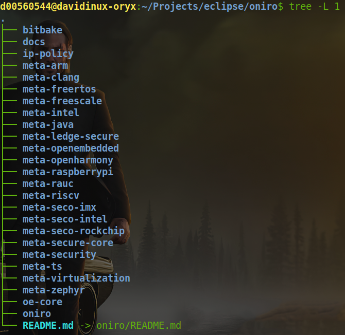

<!-- All images are under open source license, courtesy of pexels.com  -->

<!-- Title Slide  -->

# What's new in the land of Oniro 2.0

---
<!-- paginate: true -->

<!-- Slide 1 -->

# Oniro, production-grade open source

  * Eclipse Foundation project and working group with 9 members
  * Launched at EclipseCon 2021
  * A distributed OS for interoperable devices, big and small
  * Opinionated defaults: reference images as opposed to collection of libraries
  * Continuous Integration, Continuous Deployment, Continuous Validation, Continuous Compliance
  * Compliance envelope: production artifacts such as V&V reports, SWBOM
  * Bugs and CVEs policies with Service Level Agreements

---

<!-- Slide 2 -->

# Market driven development

  * Market analysis 
  * Requirements grouping 
  * Work prioritization (20/80 rule)
  * Integration, opinionated defaults and blueprints, testing, documenting, compliance artifacts (60/10/10/10/10)
  * Infrastructure

---

<!-- Slide 3 -->

# Down the Oniro 2.0 hole

---

<!-- Slide 4 -->

# The sausages ... err OS images making factory 

## Bitbake

  * Heart of the Yocto Project
    * Broad collection of Linux libraries and software
  * Linaro's Ledge project
    * Hardware scalability
  * Layered architecture

---

<!-- Slide 5 -->

# Oniro's 2.0 layers
  * build system
  * oniro recipes
  * open embedded core recipes (including linux kernel)
  * hardware support
  * documentation
  * ip policy
  * zephyr and freertos
  * system OTA
  * openharmony

---

<!-- Slide 6 -->

# Devices, big and small (a.k.a. "flavours")

  * Linux 5.10 for higher end devices (Cortex A, Intel, RISC-V)
  * Zephyr 3.1 (default, LF project, used by Linaro's Lite) for lower end devices (Cortex M)
  * FreeRTOS (experimental)
  * Lite OS (comes with meta-openharmony, used in Huawei's devices)

---

<!-- Slide 7 -->

# Hardware support 

## Supported 
  * Seco's NXP i.MX8 (Cortex A + M Linux + Zephyr), Intel and Rockchip (Linux)
  * QEMU 32 and 64, Intel, Arm, RISC-V
  * Raspberry Pi (Linux)
  * Arduino Nano BLE (Zephyr)

---

<!-- Slide 8 -->

# Interoperability, connectivity, ... middleware 

  * Project Matter SDK 1.0 (protocol)
  * OpenThread 1.3 (transparent gateway)
  * OpenHarmony (devices interoperability)
  * Podman (containers)
  * ModBUS (industrial IoT)
  * LVGL / Flutter (UI portability)
  * SysOTA

---

<!-- Slide 9 -->

# Devices interoperability with OpenHarmony
  * OpenHarmony features packaged into meta-openharmony layer
  * IP analysis and audit ongoing, ETA for release end of 2022
  * When included, meta-openharmony turns Oniro into OpenHarmony Compatible 
  * Screens and cameras cooperation 
  * New graphical framework for smoother UX and animations
  * LiteOS Cortex M55 support and AI coprocessors
  * Distributed data object capabilities

---

<!-- Slide 10 -->

# Distributed devices agency (anyone knows Eddie?)
  * Working implementation on Linux and Zephyr
  * Communication and virtualization layers
  * CoAP based resource directory
  * Integrated into doorlock and smart panel blueprints

---

<!-- Slide 11 -->

# Compliance envelope, verification and validation

  * OpenChain and OpenSSF
  * Continuous license compliance with dashboard and SWBOM for supported configurations
  * LAVA (Linaro Automation and Validation) with central server and peripherical hw labs nodes

---

<!-- Slide 12 -->

# Oniro's IP team rocks!

  * ~4M source files audited in 9 months
  * 98% coverage
  * ~100 issues uncovered and filed with relevant upstream(s)
  * Yocto multilayer fetcher and override
  * Scancode and Fossology import improvements into pipeline
  * Complete restructuring of pipeline and deeper integration with gitlab
  * Automatic generation of SWBOM per release image

---

<!-- Slide 13 -->

# V&V integrated into Oniro's relase process

  * Test plan with 100% coverage of release epicsi
  * 80% release epics tested with 85% pass rate
  * LAVA nodes included in automation testing
  * Bug triage process between dev and test and maintenance
  * Checkbox devices integration 

---

<!-- Slide 14 -->

# System OTA

  * Hawkbit devices updates campaigns management 
  * RAUC integration with Hawkbit
  * RAUC bundles integrity checker
  * RAUC interaction with boot storage and reboot results
  * State update backup
  * NetOTA

---

<!-- Slide  15 -->

# Thank you
